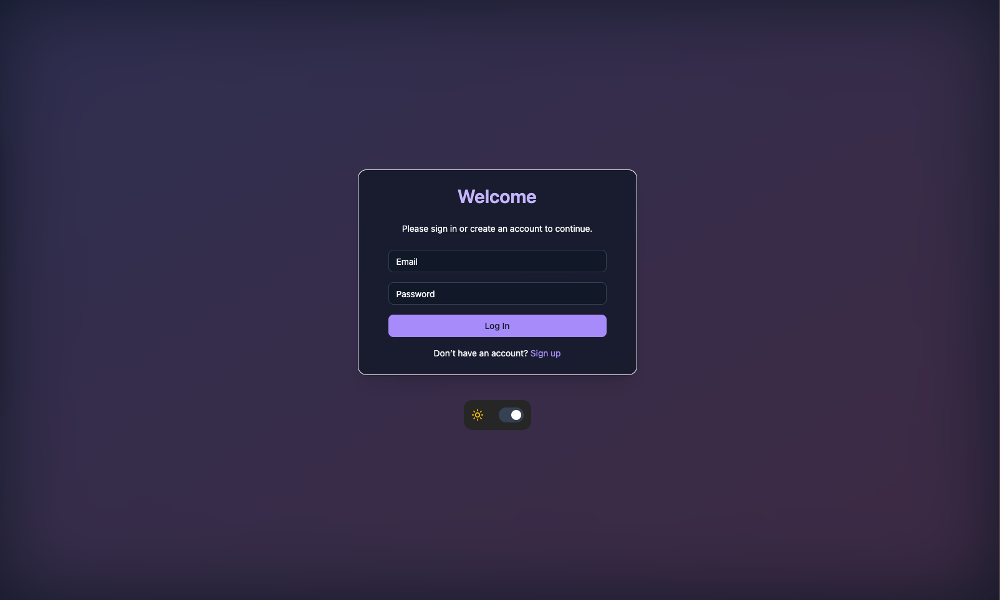
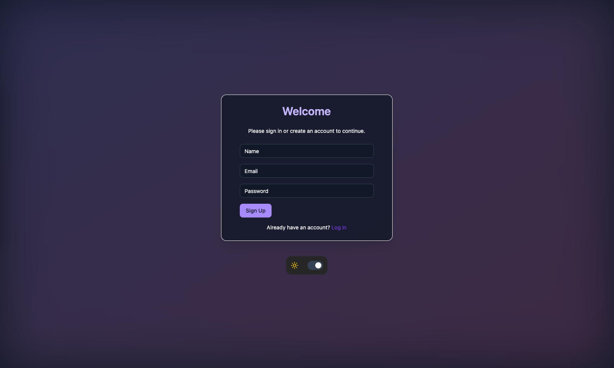
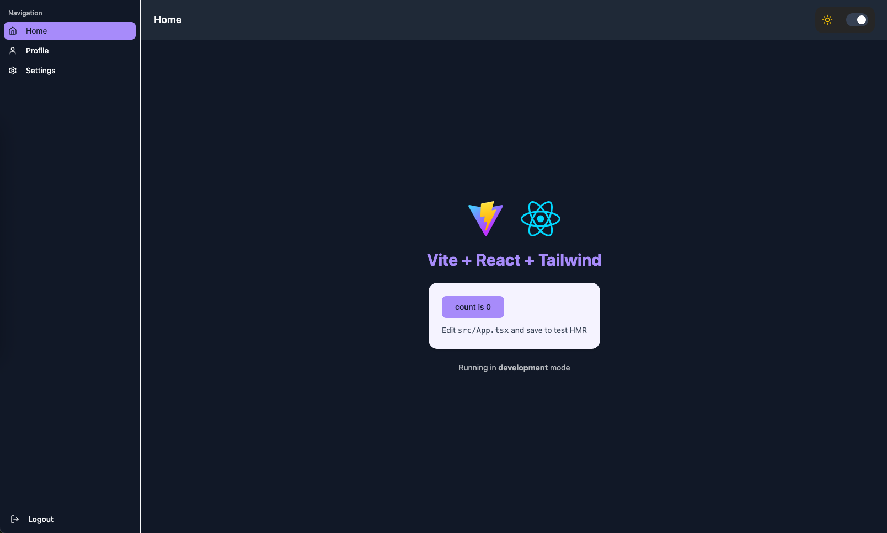

# 🌙 noctra-react-starter

**noctra-react-starter** is a modern React + TypeScript starter built with **Vite**, **Tailwind CSS**, **Zustand**, **Zod**, **React Hook Form**, and **Shadcn**.  
It’s designed for scalability, modularity, and developer productivity — perfect for starting modern web apps fast.

<table>
  <tr>
    <td align="center">
      
      <br/>
      <sub>🪪 Login Screen</sub>
    </td>
    <td align="center">
      
      <br/>
      <sub>🪪 SignUp Screen</sub>
    </td>
    <td align="center">
      
      <br/>
      <sub>🏠 Home Screen</sub>
    </td>
  </tr>
</table>
---

## 🚀 Tech Stack

- ⚛️ **React 19** + **Vite 7** (blazing-fast dev server & build)
- 💅 **Tailwind CSS 4** with `class-variance-authority` & `tailwind-merge`
- 🎨 **Radix UI**, **Lucide Icons**, **Framer Motion**
- 🧠 **Zustand** for global state management
- 🧾 **React Hook Form** + **Zod** for form handling and validation
- 🔄 **React Router v7**
- 💬 **Sonner** for elegant toast notifications
- 🌗 **next-themes** for dark/light theme toggling
- ✅ **TypeScript** + **ESLint** (configured for modern React)

---

## 📁 Folder Structure

```
src/
├─ config/ # Global configuration (routes, constants, etc.)
├─ features/ # Feature-based architecture
│ └─ [feature]/
│   ├─ guards/ # Route guards and auth protection
│   ├─ hooks/ # Auth-specific hooks
│   ├─ screens/ # Login and Signup screens
│   ├─ stores/ # Zustand stores for auth
│   └─ typings/ # Type definitions (login.ts, user.ts, etc.)
│
├─ shared/ # Reusable code across features
│ ├─ assets/
│ │ ├─ images/
│ │ └─ styles/
│ ├─ components/ # Shared UI components (buttons, inputs, etc.)
│ ├─ hooks/ # Shared reusable hooks
│ ├─ layouts/ # Reusable layout components
│ ├─ stores/ # Global Zustand stores (if needed)
│ └─ lib/ # Utility functions / helpers
│
└─ main.tsx # App entry point
```

---

## ⚙️ Setup

### 1️⃣ Clone the repository

```bash
git clone https://github.com/noctra-cc/noctra-react-starter.git
cd noctra-react-starter
```

### 2️⃣ Install dependencies

```bash
# npm
npm install
# or yarn
yarn
# or pnpm
pnpm install
# or bun
bun install
```

### 3️⃣ Configure environment variables

```bash
cp .env.example .env
# then edit .env with your environment-specific values
```

### 4️⃣ Run the development server

```bash
# npm
npm run dev
# or bun
bun run dev
```

Vite will start a local dev server, usually at
👉 http://localhost:5173

## 🧩 Key Libraries

| Purpose            | Library                                  |
| ------------------ | ---------------------------------------- |
| UI components      | Radix UI, Lucide React                   |
| Styling            | Tailwind CSS 4, class-variance-authority |
| State management   | Zustand                                  |
| Forms & validation | React Hook Form + Zod                    |
| Routing            | React Router v7                          |
| Animations         | Framer Motion                            |
| Notifications      | Sonner                                   |

---

## 🧠 Project Philosophy

This starter embraces:

- **Feature-based architecture** → scalable, isolated modules per domain
- **Type safety** → strong typing via TypeScript and Zod
- **Composable UI** → built around reusable, styled, and animated components
- **Performance-first** → powered by Vite and React 19
- **DX optimized** → hot reload, linting, and predictable folder structure

<br/>
<br/>
<br/>

# 🎨 Using shadcn/ui Components

This starter includes a full **shadcn/ui** setup — a customizable component system built on **Radix UI**, **Tailwind CSS**, and **React**.

You can easily add new UI components using the **shadcn CLI**.

---

## ⚙️ 1. Verify your setup

Make sure a `components.json` file exists in the root directory.  
It defines how and where new components are generated:

```json
{
  "$schema": "https://ui.shadcn.com/schema.json",
  "style": "default",
  "rsc": false,
  "tsx": true,
  "tailwind": {
    "config": "tailwind.config.ts",
    "css": "src/shared/assets/styles/global.css",
    "baseColor": "zinc",
    "cssVariables": true
  },
  "aliases": {
    "components": "@/shared/components",
    "utils": "@/shared/lib/utils"
  }
}
```

If it’s missing, initialize it with:

```bash
npx shadcn@latest init
```

## 🧩 2. Add new components

To add components, run the following command:

```bash
npx shadcn@latest add button
```

Or add multiple components at once:

```bash
npx shadcn@latest add input form dialog card
```

New components will be created under:

```bash
src/shared/components/ui/
```

Then import and use them anywhere:

```js
import { Button } from "@/shared/components/ui/button";

export function Example() {
return <Button variant="outline">Click me</Button>;
}
```

---

## 🧰 Recommended Extensions (VS Code)

- Tailwind CSS IntelliSense
- ESLint
- Prettier
- TypeScript React (tsx)

---

**Made with ❤️ and ☕ by Noctra**
